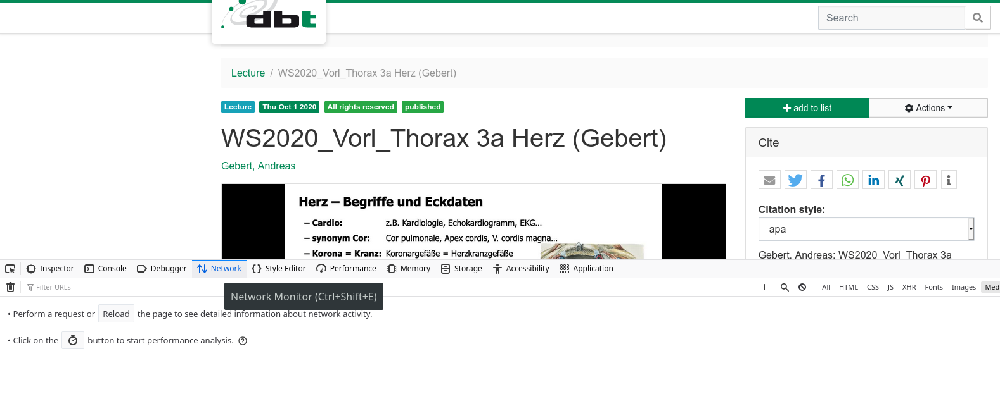
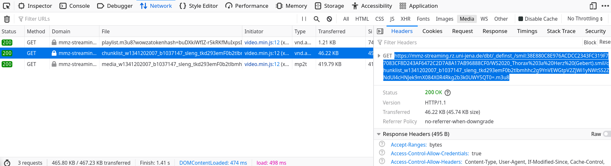
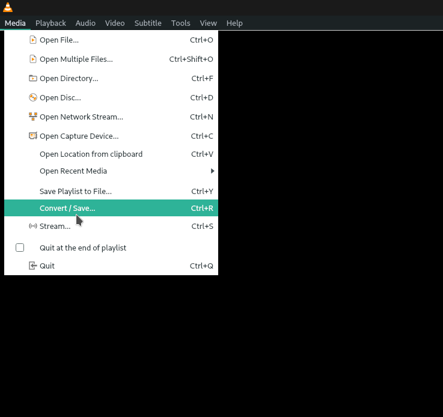

# m3u8script
A script to facilitate downloading videos saved as .m3u8 in general.

## Finding the .m3u8 file
[Please extract the URL to your .m3u8 file first:](findm3u8.mp4)

In pictures:

## Using the tool
The tool does not need to be installed. All you might need to do is install Java.
You can then run it:

## Options
|option|explanation|
|----|----|
|`-single *m3u8URL*`| allows you to download and convert a single .m3u8 file. In this case, output must either end with a *folder/* or with *file.m3u8*|
|`-multi *textfile*`| allows you to specify the path to a text file that contains links to .m3u8 files, allowing hands-free batch processing. -output must specify a folder path|
|`-output *fileorfolder*`| specifies a local directory path. When using ’-multi’, it must contain only a folder name, since filenames will be applied automatically. When used with -single, it can contain a full filename, ideally having the file extension .m3u8. If you want to use auto-naming with '-single', the path must end with a / (forwardslash)|
|`-prefix *prefixToUse*`| You can use this command to specify the pattern this script should look for. Default should work in most cases. |

## Downloading
You can then use ffmpeg or VLC media player to download the videos:

